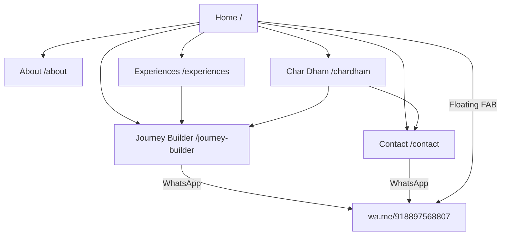

# Sattva Sanctum — Full Project Analysis

## Project Overview

**Sattva Sanctum** is a Next.js 14 web application for a spiritual/experiential travel platform based in India. Founded by **D. Sai Naveen** and built by **Rithwik**, it positions itself as *"India's first life experience platform"* offering spiritual travel, forest living, adventure, and cultural journeys.

The primary CTA funnels users to **WhatsApp** (`+91 88975 68807`) for booking and enquiries — there is no backend/database.

---

## Tech Stack

| Layer | Technology | Version |
|-------|-----------|---------|
| Framework | Next.js (App Router) | 14.2.18 |
| UI Library | React | ^18.3.1 |
| Styling | Tailwind CSS | ^3.4.15 |
| Fonts | Google Fonts (Cormorant Garamond + DM Sans) | via `next/font` |
| Images | Unsplash (remote) | via `next/image` |
| Build | PostCSS + Autoprefixer | standard |
| Linting | ESLint + eslint-config-next | ^8.57.0 |

---

## File Structure

```
📁 src/
├── 📁 app/
│   ├── globals.css              (484 B) — Tailwind directives, marquee animation
│   ├── layout.js              (1.2 KB) — Root layout with Navbar, Footer, WhatsApp FAB
│   ├── page.js               (20.9 KB) — Homepage (hero, experiences, journeys, testimonials)
│   ├── 📁 about/
│   │   └── page.js            (8.8 KB) — About page (story, values, team, stats)
│   ├── 📁 chardham/
│   │   └── page.js           (25.3 KB) — Char Dham pilgrimage page (detailed itinerary, pricing)
│   ├── 📁 contact/
│   │   └── page.js           (12.8 KB) — Contact form → WhatsApp redirect
│   ├── 📁 experiences/
│   │   └── page.js           (19.4 KB) — Filterable experience catalog with pricing table
│   └── 📁 journey-builder/
│       └── page.js           (19.4 KB) — 5-step wizard with live cost estimator
├── 📁 components/
│   ├── Navbar.js              (3.5 KB) — Responsive nav with mobile hamburger menu
│   ├── Footer.js              (1.7 KB) — Footer with brand + links
│   ├── RevealSection.js         (469 B) — Scroll-reveal wrapper (IntersectionObserver)
│   └── WhatsAppButton.js      (2.1 KB) — Floating WhatsApp FAB with click tracking
└── 📁 hooks/
    └── useReveal.js             (766 B) — Custom hook for scroll-triggered reveal animations
```

**Total source files:** 12 • **Total source bytes:** ~115 KB

---

## Pages & Routes

| Route | Type | Key Features |
|-------|------|-------------|
| `/` | Server Component | Hero section, marquee, 6 experience cards, 4 signature journeys, how-it-works stepper, destinations grid, testimonials, CTA |
| `/about` | Server Component | Story section, 6 values grid, 3 team members, stats bar (500+ experiences, 4.9★, 12+ destinations, ₹10 Cr vision) |
| `/chardham` | Client Component | Tabbed 14-day itinerary, 4 dham deep-dives, seasonal travel guide, 3-tier pricing (₹35K / ₹65K / ₹1.2L), essentials checklist, testimonials |
| `/experiences` | Client Component | Filter bar (Spiritual, Forest, Adventure, Water, Cultural), sticky jump nav, featured + grid cards per category, pricing tiers table |
| `/contact` | Client Component | 7-field enquiry form → WhatsApp message, direct contact cards, response time table |
| `/journey-builder` | Client Component | 5-step wizard (Category → Destination → Duration/Style → Modules → Details), live cost estimator sidebar, WhatsApp submission |

---

## Design System

### Color Palette (Tailwind Custom)

| Token | Hex | Usage |
|-------|-----|-------|
| `green-deep` | `#184734` | Primary brand, CTAs, nav |
| `green-soft` | `#2d6a4f` | Secondary accents, hover states |
| `gold` | `#c99a3b` | Highlight, pricing, featured badges |
| `gold-soft` | `#f3e5c5` | Light gold for text on dark backgrounds |
| `cream` | `#faf8f2` | Page background |
| `text-main` | `#1e1b16` | Body text |
| `text-soft` | `#7b7467` | Muted/secondary text |
| `border-soft` | `#e3ded4` | Subtle borders |

### Typography
- **Serif:** Cormorant Garamond (headings, display text)
- **Sans:** DM Sans (body, UI elements)

### UI Patterns
- **RevealSection** — Scroll-triggered fade-up animation (IntersectionObserver, 12% threshold, 700ms transition)
- **Marquee** — Infinite horizontal scroll ticker (32s CSS animation)
- **Rounded cards** — `rounded-2xl` with `border-border-soft` and `shadow-sm`
- **Pill buttons** — `rounded-full` with green-deep/gold fills
- **Gradient overlays** — Dark-to-transparent overlays on all hero images

---

## Strengths ✅

| Area | Details |
|------|---------|
| **Design quality** | Cohesive earthy palette, premium serif typography, consistent card patterns |
| **Scroll animations** | Smooth reveal-on-scroll via IntersectionObserver (reusable hook) |
| **Content depth** | Char Dham page has rich itinerary data, historical context, and practical info |
| **Journey Builder** | Interactive 5-step wizard with real-time pricing — strong UX differentiator |
| **Mobile nav** | Responsive hamburger menu with smooth toggle |
| **SEO metadata** | Proper `<title>` and `<meta description>` in root layout |
| **WhatsApp integration** | Floating FAB + form→WhatsApp flow with click tracking |
| **Image optimization** | Using `next/image` with responsive `sizes` attributes |

---

## Issues & Opportunities 🔧

### Critical Issues

| # | Issue | File | Details |
|---|-------|------|---------|
| 1 | **No `<head>` metadata on sub-pages** | All sub-pages | Only root layout has `metadata` export. Sub-pages like `/about`, `/chardham`, etc. should export their own `metadata` for proper SEO titles and descriptions |
| 2 | **Empty `alt` attributes on all images** | All pages | Every `<Image>` uses `alt=""`. Needs descriptive alt text for accessibility and SEO |
| 3 | **No favicon or Open Graph images** | `layout.js` | Missing social sharing metadata (og:image, twitter:card) |
| 4 | **Instagram link is placeholder** | `contact/page.js:233` | Links to `https://instagram.com` with text "placeholder link" |

### Performance Concerns

| # | Issue | Details |
|---|-------|---------|
| 5 | **Heavy Unsplash dependency** | All images load from Unsplash CDN. No local fallbacks or `placeholder="blur"` — slow first paint on weak connections |
| 6 | **Re-rendering on tab change (Char Dham)** | `RevealSection` wraps the itinerary content area — re-mounts and re-animates every tab click |
| 7 | **No loading states** | Journey Builder and Contact form have no loading/spinner feedback during WhatsApp redirect |

### Architecture Observations

| # | Observation | Details |
|---|-------------|---------|
| 8 | **No shared data layer** | Experience data is duplicated across `page.js`, `experiences/page.js`, and `journey-builder/page.js` — should be in a shared `data/` folder |
| 9 | **Client components where not needed** | `experiences/page.js` is `"use client"` mainly for the filter — could use URL search params for server-side filtering |
| 10 | **No error or 404 page** | Missing `not-found.js` and `error.js` in the app directory |
| 11 | **No sitemap or robots.txt** | Missing for SEO crawlability |
| 12 | **Hardcoded WhatsApp number** | `918897568807` appears in 7+ places — should be a constant in a shared config |

### UX Improvements

| # | Suggestion | Details |
|---|-----------|---------|
| 13 | **No back-to-top button** | Long pages (especially Char Dham at 500+ lines) need a scroll-to-top |
| 14 | **Journey Builder has no progress indicator** | A progress bar showing 1/5 → 5/5 would help user orientation |
| 15 | **No page transitions** | Navigation between pages feels abrupt — could add subtle transitions |
| 16 | **Testimonials are static** | Only 3 hard-coded testimonials per section — could rotate or have a larger pool |

---

## Pricing Data Summary

### Char Dham Packages
| Tier | Price (per person) | Details |
|------|-------------------|---------|
| Bhakti | ₹35,000 | Shared transport, budget stays |
| Shakti | ₹65,000 | Private cab, mid hotels, priority darshan |
| Moksha | ₹1,20,000 | Premium stays, helicopter options, private guide |

### Experience Pricing Bands
| Tier | Per Day | Target |
|------|---------|--------|
| Essential | ₹5,000 | Clean stays, shared transport |
| Comfort | ₹12,000 | Private transfers, better rooms |
| Luxury | ₹25,000+ | Heritage hotels, exclusive access |

---

## Business Logic

### Journey Builder Pricing Formula
```
estimate = days × (stylePerDay + Σ moduleExtras) × categoryFactor × destinationFactor
lowEstimate = estimate × 0.92
highEstimate = estimate × 1.08
```

**Category factors:** Spiritual (1.05), Forest (1.12), Adventure (1.10), Water (1.04), Cultural (1.03), World Retreats (1.18)

**Destination factors:** Varanasi (1.00), Uttarakhand (1.08), Rishikesh (1.02), Kerala (1.06), Bali (1.20), Custom (1.15)

**Module extras (per day):** Stay +₹800, Transport +₹1,500, Guide +₹2,000, Experiences +₹2,500, Volunteering +₹500, Meals +₹1,200

---

## Navigation Map



---

## Summary

This is a well-structured, content-rich marketing website for a spiritual travel startup. The design system is cohesive and premium-feeling. The Journey Builder with live cost estimation is the standout feature. Main areas for improvement are **SEO (sub-page metadata, alt text, sitemap)**, **data consolidation (shared constants)**, and **polish (error pages, loading states, accessibility)**.
